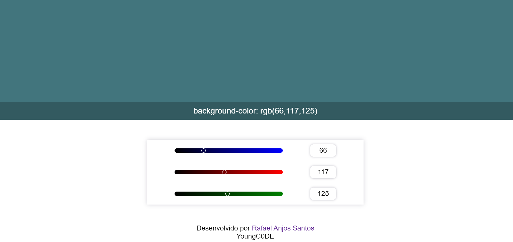

# Color Generator 👨‍🎨

Gerador de cores no formato RGB

Linguagens utilizadas:

- HTML5,
- CSS3,
- JavaScript.

## 

Acesse por aqui: [ColorGenerator](https://youngc0de.github.io/ColorGenerator/).

